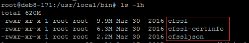
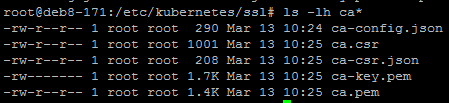
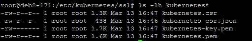
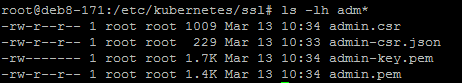
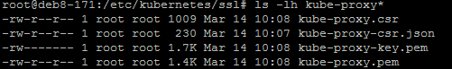

# 开始生成证书:

> 我们所有服务器使用同一套证书, 所以需要事先在一台服务器生成好, 然后再复制到其他服务器, 这里选择其中一台服务器

## 安装 CFSSL
```bash
$ wget https://pkg.cfssl.org/R1.2/cfssl_linux-amd64
$ chmod +x cfssl_linux-amd64
$ sudo mv cfssl_linux-amd64 /usr/local/bin/cfssl

$ wget https://pkg.cfssl.org/R1.2/cfssljson_linux-amd64
$ chmod +x cfssljson_linux-amd64
$ sudo mv cfssljson_linux-amd64 /usr/local/bin/cfssljson

$ wget https://pkg.cfssl.org/R1.2/cfssl-certinfo_linux-amd64
$ chmod +x cfssl-certinfo_linux-amd64
$ sudo mv cfssl-certinfo_linux-amd64 /usr/local/bin/cfssl-certinfo

$ mkdir ssl
$ cd ssl
$ cfssl print-defaults config > config.json
$ cfssl print-defaults csr > csr.json
$
```
> 如果copy到其他目录如  <br/>
> 创建目录并设置可执行权限  <br/>
> mkdir -p /opt/k8s/cfssl  <br/>
> chmod +x /opt/k8s/cfssl/*  <br/>
> 添加到环境变量, 底部追加  <br/>
> vi /etc/profile  <br/>
> ##############################################  <br/>
> export PATH=$PATH:/opt/k8s/cfssl  <br/>
> ##############################################  <br/>
> 使之生效  <br/>
> source /etc/profile  <br/>

## 创建证书(CA)
```bash
创建ca证书的配置文件
$ cd /etc/kubernetes/ssl
$ cfssl print-defaults config > config.json
$ cfssl print-defaults csr > csr.json
$ tee ca-config.json << EOF
  {
  "signing": {
    "default": {
      "expiry": "8760h"
    },
    "profiles": {
      "kubernetes": {
        "usages": [
            "signing",
            "key encipherment",
            "server auth",
            "client auth"
        ],
        "expiry": "8760h"
      }
    }
  }
}
EOF
```
+ ca-config.json：可以定义多个 profiles，分别指定不同的过期时间、使用场景等参数；后续在签名证书时使用某个 profile；
+ signing：表示该证书可用于签名其它证书；生成的 ca.pem 证书中 CA=TRUE；
+ server auth：表示client可以用该 CA 对server提供的证书进行验证；
+ client auth：表示server可以用该CA对client提供的证书进行验证；
```bash
# 创建 CA 证书签名请求
tee ca-csr.json << EOF
{
  "CN": "kubernetes",
  "key": {
    "algo": "rsa",
    "size": 2048
  },
  "names": [
    {
      "C": "CN",
      "ST": "Shenzhen",
      "L": "Shenzhen",
      "O": "k8s",
      "OU": "System"
    }
  ]
}
EOF
```
+ "CN"：Common Name，kube-apiserver 从证书中提取该字段作为请求的用户名 (User Name)；浏览器使用该字段验证网站是否合法；
+ "O"：Organization，kube-apiserver 从证书中提取该字段作为请求用户所属的组 (Group)；
```bash
# 生成 CA 证书和私钥
cfssl gencert -initca ca-csr.json | cfssljson -bare ca
ls -lh ca*
```


## 创建k8s证书
```bash
tee kubernetes-csr.json << EOF
{
  "CN": "kubernetes",
  "hosts": [
    "127.0.0.1",
    "192.168.40.171",
    "10.254.0.1",
    "kubernetes",
    "kubernetes.default",
    "kubernetes.default.svc",
    "kubernetes.default.svc.cluster",
    "kubernetes.default.svc.cluster.local"
  ],
  "key": {
    "algo": "rsa",
    "size": 2048
  },
  "names": [
    {
      "C": "CN",
      "ST": "BeiJing",
      "L": "BeiJing",
      "O": "k8s",
      "OU": "System"
    }
  ]
}
EOF
```
+ 192.168.40.171: SLB的ip地址
+ 10.254.0.1: service-cluster-ip-range 网段的第一个IP
> 如果配置了etcd集群https, 想使用这个证书, 也需要将etcd所在的服务器ip加入其中
```bash
# 生成 kubernetes 证书和私钥
cfssl gencert -ca=ca.pem -ca-key=ca-key.pem -config=ca-config.json -profile=kubernetes kubernetes-csr.json | cfssljson -bare kubernetes
ls -lh kubernetes*
```


## 创建 admin 证书
```bash
tee admin-csr.json << EOF
{
  "CN": "admin",
  "hosts": [],
  "key": {
    "algo": "rsa",
    "size": 2048
  },
  "names": [
    {
      "C": "CN",
      "ST": "BeiJing",
      "L": "BeiJing",
      "O": "system:masters",
      "OU": "System"
    }
  ]
}
EOF
```
+ 后续 kube-apiserver 使用 RBAC 对客户端(如 kubelet、kube-proxy、Pod)请求进行授权；
+ kube-apiserver 预定义了一些 RBAC 使用的 RoleBindings，如 cluster-admin 将 Group system:masters 与 Role cluster-admin 绑定，该 Role 授予了调用kube-apiserver 的所有 API的权限；
+ OU 指定该证书的 Group 为 system:masters，kubelet 使用该证书访问 kube-apiserver 时 ，由于证书被 CA 签名，所以认证通过，同时由于证书用户组为经过预授权的 system:masters，所以被授予访问所有 API 的权限
```bash
# 生成 admin 证书和私钥
cfssl gencert -ca=ca.pem -ca-key=ca-key.pem -config=ca-config.json -profile=kubernetes admin-csr.json | cfssljson -bare admin
ls admin*
```


## 创建 kube-proxy 证书
```bash
tee kube-proxy-csr.json << EOF
{
  "CN": "system:kube-proxy",
  "hosts": [],
  "key": {
    "algo": "rsa",
    "size": 2048
  },
  "names": [
    {
      "C": "CN",
      "ST": "BeiJing",
      "L": "BeiJing",
      "O": "k8s",
      "OU": "System"
    }
  ]
}
EOF
```
+ CN 指定该证书的 User 为 system:kube-proxy；
+ kube-apiserver 预定义的 RoleBinding cluster-admin 将User system:kube-proxy 与 Role system:node-proxier 绑定，该 Role 授予了调用 kube-apiserver Proxy 相关 API 的权限；
```bash
# 生成 kube-proxy 客户端证书和私钥
cfssl gencert -ca=ca.pem -ca-key=ca-key.pem -config=ca-config.json -profile=kubernetes  kube-proxy-csr.json | cfssljson -bare kube-proxy
ls -lh kube-proxy*
```

