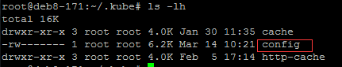
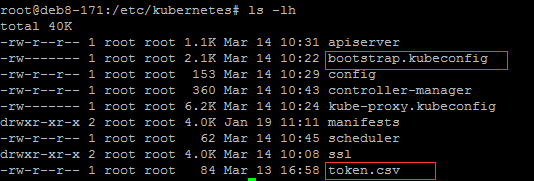

kubectl是k8s集群的命令行工具, 基本上整个集群的运维操作都靠它, 所以需要事先配置好它
## k8s运行环境配置
官网下载二进制文件：https://kubernetes.io/docs/imported/release/notes/#downloads-for-v1100
```bash
$ wget https://storage.googleapis.com/kubernetes-release/release/v1.10.0/kubernetes-server-linux-amd64.tar.gz
$ tar -zxvf kubernetes-server-linux-amd64.tar.gz
$ cd kubernetes/server/bin
$ cp -r {kube-apiserver,kube-controller-manager,kube-scheduler,kubelet,kube-proxy,kubectl} /usr/local/bin/
```
> Master只需要启动3个服务, 分别为kube-apiserver, kube-controller-manager, kube-scheduler
> Node只需要启动2个服务, 分别为kubelet, kube-proxy
##  创建kubectl kubeconfig文件
```bash
cd /etc/kubernetes
export KUBE_APISERVER="https://192.168.40.171:6443"

# 设置集群参数
kubectl config set-cluster kubernetes \
  --certificate-authority=/etc/kubernetes/ssl/ca.pem \
  --embed-certs=true \
  --server=${KUBE_APISERVER}

# 设置客户端认证参数
kubectl config set-credentials admin \
  --client-certificate=/etc/kubernetes/ssl/admin.pem \
  --embed-certs=true \
  --client-key=/etc/kubernetes/ssl/admin-key.pem

# 设置上下文参数
kubectl config set-context kubernetes \
  --cluster=kubernetes \
  --user=admin

# 设置默认上下文
kubectl config use-context kubernetes
```
+ admin.pem 证书 O 字段值为 system:masters，kube-apiserver 预定义的 RoleBinding cluster-admin 将 Group system:masters 与 Role cluster-admin 绑定，该 Role 授予了调用kube-apiserver 相关 API 的权限；
+ 生成的 kubeconfig 被保存到 ~/.kube/config 文件；
> 可以将~/.kube/config文件复制到其他用户目录下, 这样其他用户也可以使用kubectl命令了
##  创建TLS Bootstrapping Token
```bash
cd /etc/kubernetes
# 随机生成token值
export BOOTSTRAP_TOKEN=$(head -c 16 /dev/urandom | od -An -t x | tr -d ' ')
# 写入文件
tee token.csv << EOF
${BOOTSTRAP_TOKEN},kubelet-bootstrap,10001,"system:kubelet-bootstrap"
EOF
```
> 尽量不要更新BOOTSTRAP_TOKEN值, 如果要更新, kube-apiserver使用的token.csv文件和kubelet使用的bootstrap.kubeconfig文件都需要更新, 更新后还需要重启kube-apiserver和kube-proxy服务
## 创建kubelet bootstrapping kubeconfig文件
```bash
cd /etc/kubernetes
# 设置集群参数
kubectl config set-cluster kubernetes \
  --certificate-authority=/etc/kubernetes/ssl/ca.pem \
  --embed-certs=true \
  --server=${KUBE_APISERVER} \
  --kubeconfig=bootstrap.kubeconfig

# 设置客户端认证参数
kubectl config set-credentials kubelet-bootstrap \
  --token=${BOOTSTRAP_TOKEN} \
  --kubeconfig=bootstrap.kubeconfig

# 设置上下文参数
kubectl config set-context default \
  --cluster=kubernetes \
  --user=kubelet-bootstrap \
  --kubeconfig=bootstrap.kubeconfig

# 设置默认上下文
kubectl config use-context default --kubeconfig=bootstrap.kubeconfig
```
> --embed-certs 为true时, 表示将certificate-authority证书写入到生成的bootstrap.kubeconfig文件中；

## 创建kube-proxy kubeconfig文件
```bash
cd /etc/kubernetes
# 设置集群参数
kubectl config set-cluster kubernetes \
  --certificate-authority=/etc/kubernetes/ssl/ca.pem \
  --embed-certs=true \
  --server=${KUBE_APISERVER} \
  --kubeconfig=kube-proxy.kubeconfig

# 设置客户端认证参数
kubectl config set-credentials kube-proxy \
  --client-certificate=/etc/kubernetes/ssl/kube-proxy.pem \
  --client-key=/etc/kubernetes/ssl/kube-proxy-key.pem \
  --embed-certs=true \
  --kubeconfig=kube-proxy.kubeconfig

# 设置上下文参数
kubectl config set-context default \
  --cluster=kubernetes \
  --user=kube-proxy \
  --kubeconfig=kube-proxy.kubeconfig

# 设置默认上下文
kubectl config use-context default --kubeconfig=kube-proxy.kubeconfig
```
+ 设置集群参数和客户端认证参数时 --embed-certs 都为 true，这会将 certificate-authority、client-certificate 和 client-key 指向的证书文件内容写入到生成的 kube-proxy.kubeconfig 文件中；
+ kube-proxy.pem 证书中 CN 为 system:kube-proxy，kube-apiserver 预定义的 RoleBinding cluster-admin 将User system:kube-proxy 与 Role system:node-proxier 绑定，该 Role 授予了调用 kube-apiserver Proxy 相关 API 的权限；
## 分发kubeconfig文件
如果一切顺利的话, 在/etc/kubernetes文件夹和用户文件夹可以看到这些 <br/>
ls -lh ~/.kube <br/>

ls -lh /etc/kubernetes <br/>

确定无误之后 <br/>
+ 将token.csv复制到其他master相对应的/etc/kubernetes中, 供kube-apiserver使用;
+ 将bootstrap.kubeconfig和kube-proxy.kubeconfig复制到其他node节点的/etc/kubernetes中, 供kubele和kube-proxy使用
+ 将~/.kube/config复制到任意想使用kubectl命令行工具的服务器中
