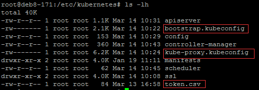
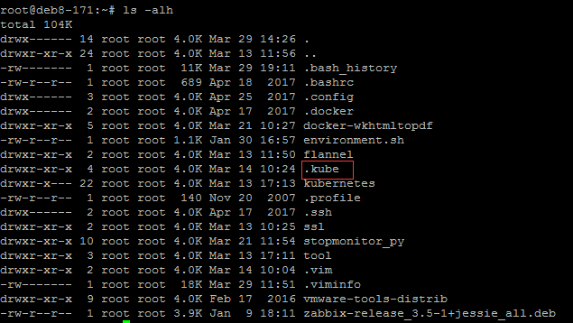
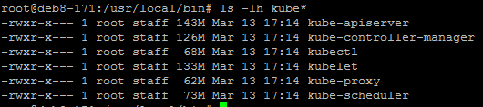
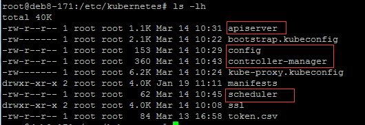
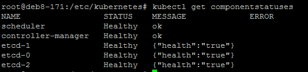
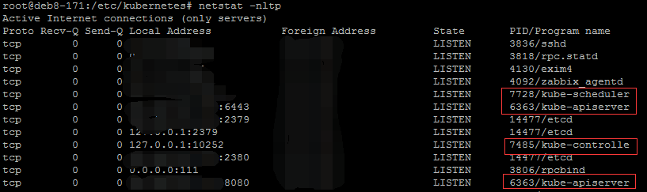

### 1.检查环境
请先确保前面的环境正常, 再进行这一步, 否则出现的各种错误很难定位
### 检查证书环境

### 检查kubectl工具类环境

### 检查当前用户信息

### 检查服务环境


### 2.配置和启动kube-apiserver
```bash
vi /etc/systemd/system/kube-apiserver.service
[Unit]
Description=Kubernetes API Service
Documentation=https://github.com/GoogleCloudPlatform/kubernetes
After=network.target
After=etcd.service

[Service]
EnvironmentFile=-/etc/kubernetes/config
EnvironmentFile=-/etc/kubernetes/apiserver
ExecStart=/usr/local/bin/kube-apiserver \
    $KUBE_LOGTOSTDERR \
    $KUBE_LOG_LEVEL \
    $KUBE_ETCD_SERVERS \
    $KUBE_API_ADDRESS \
    $KUBE_API_PORT \
    $KUBELET_PORT \
    $KUBE_ALLOW_PRIV \
    $KUBE_SERVICE_ADDRESSES \
    $KUBE_ADMISSION_CONTROL \
    $KUBE_API_ARGS
Restart=on-failure
Type=notify
LimitNOFILE=65536

[Install]
WantedBy=multi-user.target
```
***配置config***
```bash
vi /etc/kubernetes/config
KUBE_LOGTOSTDERR="--logtostderr=true"
KUBE_LOG_LEVEL="--v=0"
KUBE_ALLOW_PRIV="--allow-privileged=true"
KUBE_MASTER="--master=http://192.168.40.171:8080"
```
> --master 配置成自己的8080端口就可以了
```bash
vi /etc/kubernetes/apiserver
KUBE_API_ADDRESS="--advertise-address=192.168.40.171 --bind-address=192.168.40.171 --insecure-bind-address=192.168.40.171"
KUBE_ETCD_SERVERS="--etcd-servers=http://192.168.40.171:2379,http://192.168.40.172:2379,http://192.168.40.173:2379"
KUBE_SERVICE_ADDRESSES="--service-cluster-ip-range=10.254.0.0/16"
KUBE_ADMISSION_CONTROL="--admission-control=ServiceAccount,NamespaceLifecycle,NamespaceExists,LimitRanger,ResourceQuota"
KUBE_API_ARGS="--authorization-mode=RBAC --runtime-config=rbac.authorization.k8s.io/v1beta1 --kubelet-https=true --experimental-bootstrap-token-auth --token-auth-file=/etc/kubernetes/token.csv --service-node-port-range=30000-32767 --tls-cert-file=/etc/kubernetes/ssl/kubernetes.pem --tls-private-key-file=/etc/kubernetes/ssl/kubernetes-key.pem --client-ca-file=/etc/kubernetes/ssl/ca.pem --service-account-key-file=/etc/kubernetes/ssl/ca-key.pem --enable-swagger-ui=true --apiserver-count=3 --audit-log-maxage=30 --audit-log-maxbackup=3 --audit-log-maxsize=100 --audit-log-path=/var/lib/audit.log --event-ttl=1h"
```
+ KUBE_API_ADDRESS: 注意绑定的IP地址 不要 写成127.0.0.1, 要写成具体的IP地址(如果是阿里云的经典网络, 最好选择内网地址, 提升网络传输)
+ KUBE_ETCD_SERVERS: 注意ETCD集群地址写法
+ KUBE_SERVICE_ADDRESSES: 这个统一固定就好, 要和前面生成证书所指定的地址段一致
```bash
# 保存配置文件, 并启动kube-apiserver
systemctl daemon-reload
systemctl enable kube-apiserver
systemctl start kube-apiserver
systemctl status kube-apiserver -l
```
### 3.配置和启动kube-controller-manager
```bash
vi /etc/systemd/system/kube-controller-manager.service
[Unit]
Description=Kubernetes Controller Manager
Documentation=https://github.com/GoogleCloudPlatform/kubernetes

[Service]
EnvironmentFile=-/etc/kubernetes/config
EnvironmentFile=-/etc/kubernetes/controller-manager
ExecStart=/usr/local/bin/kube-controller-manager \
    $KUBE_LOGTOSTDERR \
    $KUBE_LOG_LEVEL \
    $KUBE_MASTER \
    $KUBE_CONTROLLER_MANAGER_ARGS
Restart=on-failure
LimitNOFILE=65536

[Install]
WantedBy=multi-user.target
#######################################################
vi /etc/kubernetes/controller-manager
KUBE_CONTROLLER_MANAGER_ARGS="--address=127.0.0.1 --service-cluster-ip-range=10.254.0.0/16 --cluster-name=kubernetes --cluster-signing-cert-file=/etc/kubernetes/ssl/ca.pem --cluster-signing-key-file=/etc/kubernetes/ssl/ca-key.pem  --service-account-private-key-file=/etc/kubernetes/ssl/ca-key.pem --root-ca-file=/etc/kubernetes/ssl/ca.pem --leader-elect=true"
```
+ --cluster-signing-* 指定的证书和私钥文件用来签名为 TLS BootStrap 创建的证书和私钥；
+ --root-ca-file 用来对 kube-apiserver 证书进行校验，指定该参数后，才会在Pod 容器的 ServiceAccount 中放置该 CA 证书文件；
+ --address 值必须为 127.0.0.1，因为当前 kube-apiserver 期望 scheduler 和 controller-manager 在同一台机器
```bash
# 保存配置并启动
systemctl daemon-reload
systemctl enable kube-controller-manager
systemctl start kube-controller-manager
systemctl status kube-controller-manager -l
```
### 4.配置和启动kube-scheduler
```bash
vi /etc/systemd/system/kube-scheduler.service
[Unit]
Description=Kubernetes Scheduler Plugin
Documentation=https://github.com/GoogleCloudPlatform/kubernetes

[Service]
EnvironmentFile=-/etc/kubernetes/config
EnvironmentFile=-/etc/kubernetes/scheduler
ExecStart=/usr/local/bin/kube-scheduler \
        $KUBE_LOGTOSTDERR \
        $KUBE_LOG_LEVEL \
        $KUBE_MASTER \
        $KUBE_SCHEDULER_ARGS
Restart=on-failure
LimitNOFILE=65536
################################
vi /etc/kubernetes/scheduler
KUBE_SCHEDULER_ARGS="--leader-elect=true --address=127.0.0.1"
```
+ -address 值必须为 127.0.0.1，因为当前 kube-apiserver 期望 scheduler 和 controller-manager 在同一台机器；
```bash
# 保存配置并启动
systemctl daemon-reload
systemctl enable kube-scheduler
systemctl start kube-scheduler
systemctl status kube-scheduler -l
```
+ 注：不同于API Server，Master中另外两个核心组件kube-controller-manager和kube-scheduler会修改集群的状态信息，
因此对于kube-controller-manager和kube-scheduler而言，高可用不仅意味着需要启动都给实例，还需要这对多个实例实现选举并选举出leader,
以保证同一时间只有一个实例可以对集群状态信息进行读写，避免出现同步问题和一致性问题。k8s对于这种选举机制的实现采用租赁锁（lease-lock）实现，
我们可以通过在kube-controller-manager和kube-scheduler的每个实例的启动参数中设置--leader-elect=true,保证同一时间只会运行一个可修改集群|
信息的实例

### 5.验证master节点功能
4个配置文件 <br/>

```bash
# 查看节点状态
kubectl get componentstatuses
```

```bash
# 查看端口情况
netstat -nltp
```

> 其他几台master也需要按照上述相同的配置, 只需要把相对应的ip地址换成自己的, 记住, 证书一定要相同


