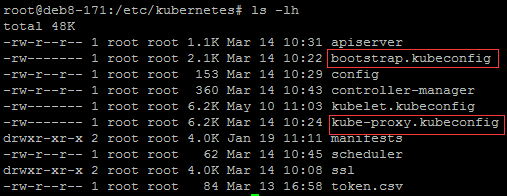
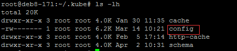
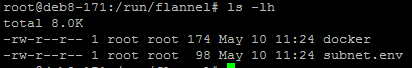
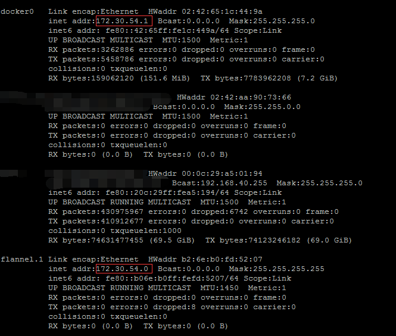

### 1.检查环境
请先确保前面的环境正常, 再进行这一步, 否则出现的各种错误很难定位</br>
#### 检查证书环境

#### 检查kubelet和kube-proxy环境

#### 检查kubectl工具类环境


### 2.k8s运行环境
#### 将master可执行文件目录远程复制过来
```bash
下载kubernetes server 所在目录
scp -rp /root/kubernetes/server/bin/{kubectl,kubelet,kube-proxy} root@192.168.40.172:/usr/local/bin/
这里kubectl copy到各机器方便查询
```
> Node只需要启动2个服务, 分别为kubelet, kube-proxy(master可以是node)

### 3.安装配置Docker和Flannel
> Docker 安装参考官网 Docker version 1.12.6 
#### Flannel安装
```bash
$ mkdir flannel
$ wget https://github.com/coreos/flannel/releases/download/v0.7.1/flannel-v0.7.1-linux-amd64.tar.gz
$ tar -xzvf flannel-v0.7.1-linux-amd64.tar.gz -C flannel
$ sudo cp flannel/{flanneld,mk-docker-opts.sh} /usr/local/bin
```
#### 向 etcd 写入集群 Pod 网段信息
> 注意：本步骤只需在第一次部署 Flannel 网络时执行，后续在其它节点上部署 Flannel 时无需再写入该信息！
```bash
etcdctl --endpoints=http://192.168.1.50:2379,http://192.168.1.51:2379 \
set /kubernetes/network/config \
'{"Network":"172.30.0.0/16","SubnetLen":24,"Backend":{"Type":"vxlan"}}'
```

#### 创建 flanneld 的 systemd unit 文件
```bash
vi /etc/systemd/system/flanneld.service

[Unit]
Description=Flanneld overlay address etcd agent
After=network.target
After=network-online.target
Wants=network-online.target
After=etcd.service
Before=docker.service

[Service]
Type=notify
ExecStart=/usr/local/bin/flanneld \
  -etcd-endpoints=http://192.168.40.171:2379,http://192.168.40.172:2379,http://192.168.40.173:2379 \
  -etcd-prefix=/kubernetes/network
ExecStartPost=/usr/local/bin/mk-docker-opts.sh -k DOCKER_NETWORK_OPTIONS -d /run/flannel/docker
Restart=on-failure

[Install]
WantedBy=multi-user.target
RequiredBy=docker.service

# 设置开机启动并启动
systemctl enable flanneld --加入开机启动
systemctl start flanneld
systemctl status flanneld -l
```
#### 当服务启动后, 可以在/run/flannel文件夹下看到两个文件


#### 创建 docker 的启动文件修改
```bash
vi /lib/systemd/system/docker.service

[Unit]
Description=Docker Application Container Engine
Documentation=https://docs.docker.com
After=network.target docker.socket
Requires=docker.socket

[Service]
Type=notify
EnvironmentFile=-/run/flannel/docker    #此处添加
# the default is not to use systemd for cgroups because the delegate issues still
# exists and systemd currently does not support the cgroup feature set required
# for containers run by docker
ExecStart=/usr/bin/dockerd -H fd:// --log-level=error $DOCKER_NETWORK_OPTIONS #此处修改
ExecReload=/bin/kill -s HUP $MAINPID
# Having non-zero Limit*s causes performance problems due to accounting overhead
# in the kernel. We recommend using cgroups to do container-local accounting.
LimitNOFILE=infinity
LimitNPROC=infinity
LimitCORE=infinity
# Uncomment TasksMax if your systemd version supports it.
# Only systemd 226 and above support this version.
#TasksMax=infinity
TimeoutStartSec=0
# set delegate yes so that systemd does not reset the cgroups of docker containers
Delegate=yes
# kill only the docker process, not all processes in the cgroup
KillMode=process

[Install]
WantedBy=multi-user.target

# 重启docker
systemctl daemon-reload
systemctl enable docker
systemctl restart docker
```
#### 查看网卡信息, 可以看到他们应该在同一网段里面

### 4.安装和配置kubelet

### 5.安装和配置kube-proxy

### 6.验证

