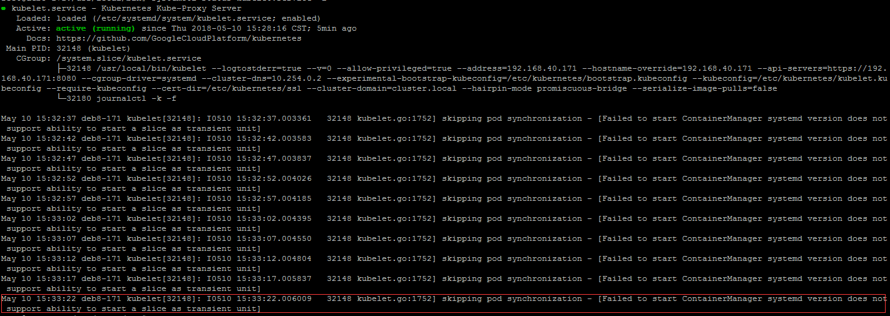

#### 1、在Debian8 上 cgroup memory swapaccount 默认没有enable
```bash
会出现如
[plain]  E0221 18:12:14.791503   16229 kubelet.go:1228] Failed to start ContainerManager system validation failed - Following Cgroup subsystem not mounted: [memory]  
ContainerManager system 无法启动从而造成容器无法被启动

解决方法：
vi /etc/default/grub中添加下面一行
GRUB_CMDLINE_LINUX="cgroup_enable=memory swapaccount=1" 
更新grub并重启可以解决
$ sudo update-grub
$ sudo reboot
```


#### 2、skipping pod synchronization - [Failed to start ContainerManager systemd version does not support ability to start a slice as transient unit]
```bash
$ docker info
Containers: 0
 Running: 0
 Paused: 0
 Stopped: 0
Images: 80
Server Version: 1.12.6
Storage Driver: aufs
 Root Dir: /var/lib/docker/aufs
 Backing Filesystem: extfs
 Dirs: 225
 Dirperm1 Supported: true
Logging Driver: json-file
Cgroup Driver: systemd
Plugins:
 Volume: local
 Network: bridge host null overlay
Swarm: inactive
Runtimes: runc
Default Runtime: runc
Security Options:
Kernel Version: 3.16.0-4-amd64
Operating System: Debian GNU/Linux 8 (jessie)
OSType: linux
Architecture: x86_64
CPUs: 2
Total Memory: 7.818 GiB
Name: deb8-171
ID: BWOH:MBUY:UPEO:4S4O:XFEL:ZRCX:AVKQ:Z7JN:WQDG:OI7U:Y7QO:SSHI
Docker Root Dir: /var/lib/docker
Debug Mode (client): false
Debug Mode (server): false
Username: cxhjet
Registry: https://index.docker.io/v1/
WARNING: No kernel memory limit support
WARNING: No cpu cfs quota support
WARNING: No cpu cfs period support
Insecure Registries:
 127.0.0.0/8
 ```
 ##### 开启kubelet错
 
 
 #### 网上查找相关只有如下
 https://github.com/gyliu513/kubernetes-handbook-1/blob/master/FAQ.md
 ```bash
 3.Kubelet启动时Failed to start ContainerManager systemd version does not support ability to start a slice as transient unit
CentOS系统版本7.2.1511

kubelet启动时报错systemd版本不支持start a slice as transient unit。

尝试升级CentOS版本到7.3，看看是否可以修复该问题。

与kubeadm init waiting for the control plane to become ready on CentOS 7.2 with kubeadm 1.6.1 #228类似。

另外有一个使用systemd管理kubelet的proposal。
```

